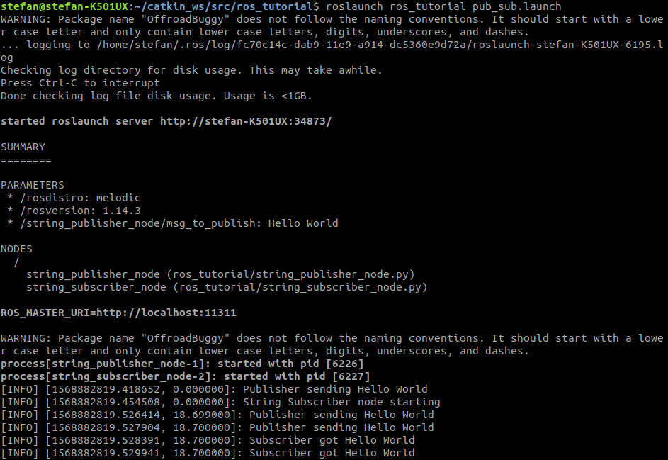
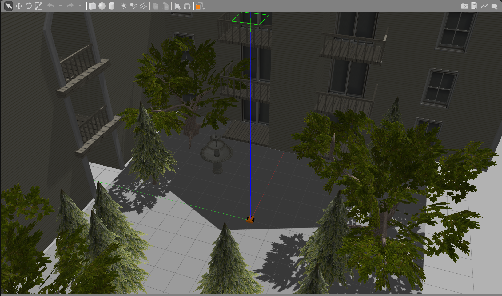
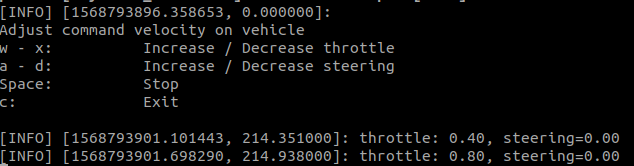
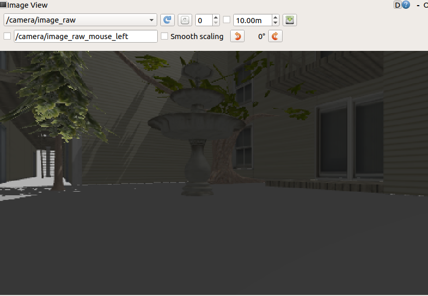
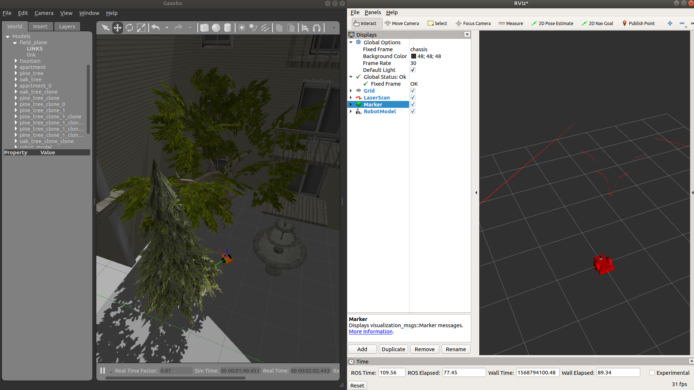
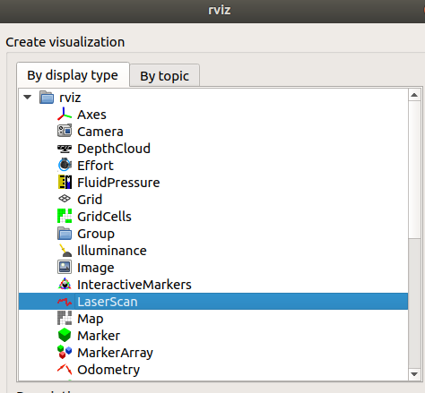
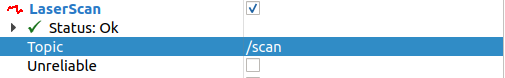

# Environment Setup
__NOTE:__ This setup process is for the 3120 Trottier lab computers which already have ROS Melodic installed on the system. Please refer to  [ROS Melodic Installation](http://wiki.ros.org/melodic/Installation/Ubuntu) for Ubuntu 18 or [ROS Kinetic Installation](http://wiki.ros.org/kinetic/Installation) for Ubuntu 16 for the complete installation process
- Source the ros setup script:

```shell script
echo "source /opt/ros/melodic/setup.bash" >> ~/.bashrc
source ~/.bashrc
```

- Make your catkin workspace: 

```shell script
cd ~
mkdir -p catkin_ws/src
``` 

- If this is the first time building the catkin workspace, be sure that `/devel/setup.bash` has been sources. 
- Assuming you are currently in the catkin workspace (pwd should output the path to your catkin_ws folder): 
```shell script
echo "source $(pwd)/devel/setup.bash" >> ~/.bashrc
source ~/.bashrc
```

- To verify that everything is setup accordingly, you can inspect the contents of your ~/.bashrc file to ensure the two lines: `source /opt/ros/melodic/setup.bash` and `source <path_to_catkin_ws>/devel/setup.bash` are present

- Place package code in the __catkin_ws/src__ folder. We will use this repository for that purpose 

```shell script
cd catkin_ws/src
git clone https://github.com/comp417-fall2019-tutorials/ros_tutorial.git
```

- Build your catkin_ws folder. Navigate back to the catkin_ws folder and execute the `catkin_make` command 
```shell script
cd ../
catkin_make
```

- Full installation instructions can be found here: [ROS Melodic Installation Guide](http://wiki.ros.org/melodic/Installation/Ubuntu)

# Simple Publisher Subscriber Example
- Launch the publisher and subscriber node

```shell script
roslaunch ros_tutorial pub_sub.launch
``` 

__Expected output:__ 



- Some additional commands to try: 
```shell script
# Show list of runnign topics
rostopic list 
# See how fast a topic is publishing 
rostopic hz /msg 
# Echo the value of a topic 
rostopic echo /msg
``` 

# Keyboard Controlled Car

- Run the launch file to create the gazebo environment
 
```shell script
roslaunch ros_tutorial world.launch 
```  



- The keyboard_control node can be used to manually control the robot agent.
- Try moving the agent around using the keyboard commands
```
roslaunch ros_tutorial keyboard_control.launch 
``` 


 
# Utilities

__RQT Image View__ 
- Launch RQT image view and subscribe to camera/iamge_raw
```shell script
rqt_image_view
```

 
__RVIZ__
- Open RVIZ from the console with the following command
```shell script
rviz 
```



- Click on the __add__ button and select topics to visualize 
- For example, select LaserScan to visualize the LIDAR returns



- After the LaserScan option has been added, make sure that it points to the right topic: __/scan__




 

